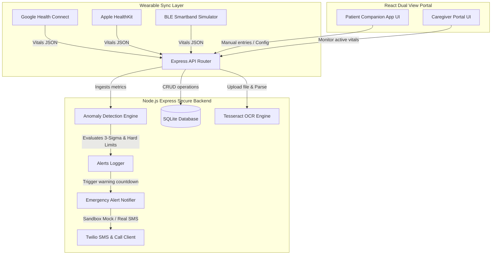

# Your Health Will Partner | Personal Health Vault & Live Anomaly Monitor

Your Health Will Partner is a secure, cross-platform personal health management ecosystem designed to sync live metrics from fitness wearables, detect critical physiological anomalies, encrypt health history (HIPAA/GDPR principles), and dispatch automated emergency alerts (SMS/calls) to pre-designated emergency contacts during a crisis.

---

## 🏛️ System Architecture



---

## 🛠️ Tech Stack & Key Modules

1. **Frontend Client:** React + Vite (Vanilla CSS glassmorphism, scrolling HTML5 Canvas ECG generator, live SVG sparklines).
2. **Backend Engine:** Node.js (Express, Cors, Multer, JSONWebTokens, Bcrypt).
3. **Database Layer:** SQLite (file-based relational engine, using AES-256-GCM column-level database encryption).
4. **Anomaly Detector:** Customized physiological limits logic + dynamic rolling window 3-Sigma standard deviation baseline checks.
5. **Emergency Notifier:** Sandbox Mock dispatcher that switches to live SMS/Phone Dialing via **Twilio API**.
6. **OCR Processing:** **Tesseract.js** (extracts text from uploaded PDF/image prescriptions).

---

## 🚀 Quick Start Setup

### Prerequisites
- Node.js (v18 or higher)
- npm (v9 or higher)

### 1. Configure Environment Variables
Create a `.env` file in the `backend/` directory:

```bash
# JWT Token Secret
JWT_SECRET=your_jwt_signing_token_secret_key

# Column level AES Encryption Key (Must be 32 characters/bytes)
DB_ENCRYPTION_KEY=v3ry_s3cr3t_k3y_for_h34lthgu4rd_

# (Optional) Twilio API Credentials - Leave blank to run in Sandbox Mock Mode
TWILIO_ACCOUNT_SID=
TWILIO_AUTH_TOKEN=
TWILIO_PHONE_NUMBER=
```

### 2. Start the Backend API
```bash
cd backend
npm install
npm start
```
*The backend will boot on port `5000` and automatically initialize the sqlite schema `Your Health Will Partner.db`.*

### 3. Start the Frontend Dashboard
Open a new terminal window and run:
```bash
cd frontend
npm install
npm run dev
```
*The Vite hot-reloading client will run on http://localhost:5173.*

---

## 📝 Verification & Test Scenarios

### Running Automated Test Suite
To execute the cryptographic and anomaly algorithm test suite:
```bash
cd backend
node test.js
```
Expected output:
```text
🧪 Starting Your Health Will Partner Automated Test Suite...

Testing AES-256-GCM data encryption...
✅ Encryption verification passed.

Testing Physiological Safety Thresholds...
✅ Static threshold checks passed.

Testing Fall Detection triggers...
✅ Fall detection checks passed.

Testing Statistical Baseline (3-Sigma) Anomaly Checks...
✅ Statistical rolling checks passed.

🎉 All automated tests completed successfully! 🎉
```

### Manual Walkthrough Instructions
1. Open http://localhost:5173 in your browser.
2. Under the **Patient Mobile App** (default layout), sign up or log in.
3. Review and sign the **Privacy & HIPAA Consent Screen** to proceed.
4. On the dashboard monitor, you will see a live **ECG wave generator** scrolling on a canvas.
5. Go to the bottom **Alerts** navigation tab, add your phone number as an emergency contact, and select "SMS alerts". Click **Execute Test Alert** to verify Twilio sandbox logs.
6. In the bottom **Vault** tab, upload a prescription image. Tesseract.js will extract the OCR text. If it detects "Amoxicillin" or "Lisinopril", it automatically appends them to your active medications list.
7. Return to the **Monitor** tab. Under **Wearable Sensor Simulator**, click **Tachycardia (>150)**.
8. The screen will immediately lock with a crimson pulsing warning page showing a 60-second countdown.
9. Switch to the **Caregiver Clinical Console** using the top header toggle. Notice that the caregiver portal flashes a synchronized high-priority notification showing the exact tachycardia values.
10. If you let the timer expire on the mobile screen, the notifier dispatches calls/SMS. If you click **I'm OK**, the alarm resolves.

---

## 🔒 Security & HIPAA Compliance
- **Encryption at Rest:** Sensitive details (such as allergies, chronic conditions, medication names, and notes) are encrypted using AES-256-GCM. The values stored in the SQL columns represent non-readable cipher strings, decrypted on-the-fly during authenticated profile fetches.
- **Auditable Log:** All alarms, acknowledgements, resolutions, and SMS dispatches are locked chronologically in the `alerts_log` table.
- **Disclaimer:** The application clearly prompts the user on startup that it is not a diagnostic tool but an alerting aid.
