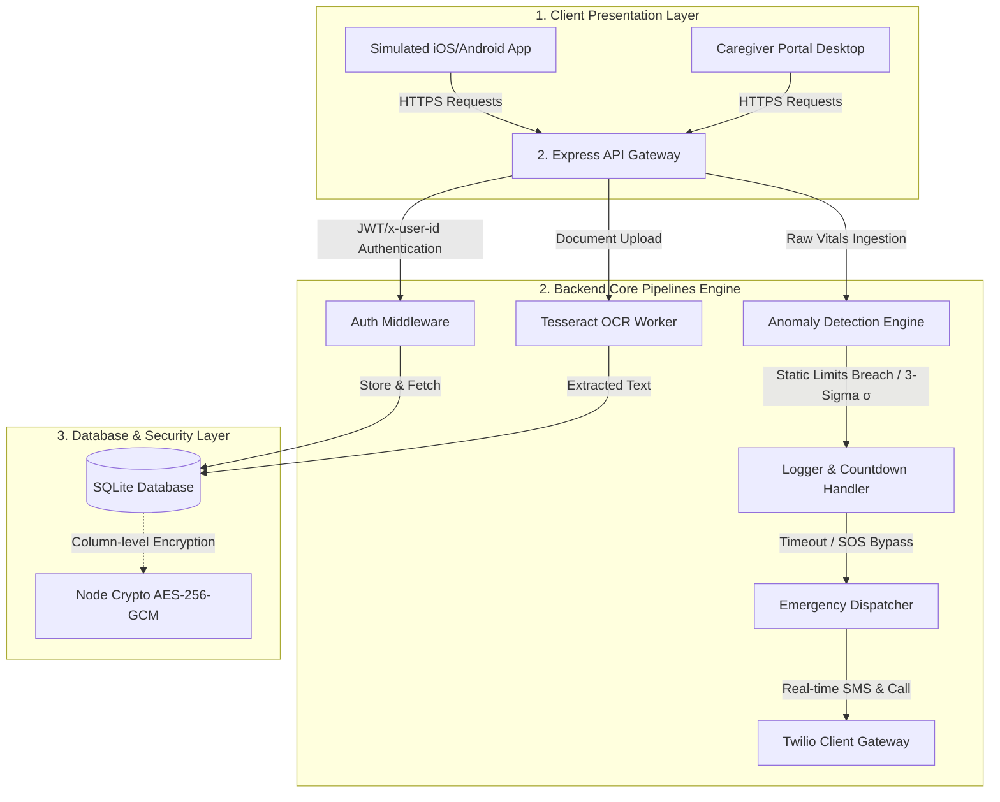

# System Architecture: Your Health Will Partner

This document provides a detailed breakdown of the system architecture, component structures, data flow pipelines, and security mechanisms implemented in **Your Health Will Partner**.

---

## 🏛️ System Component Topology

The platform operates as a secure full-stack medical hub divided into three core layers:



---

## 💾 Database Schema & Cryptographic Boundaries

We utilize SQLite for zero-setup execution, using schemas that align with PostgreSQL/TimescaleDB. To comply with HIPAA/GDPR principles of data privacy, sensitive columns containing Protected Health Information (PHI) are encrypted at rest.

### Table Structures & Encryption Scopes

1. **`users`** (Primary profile information)
   * `id` (INTEGER PRIMARY KEY)
   * `email` (TEXT UNIQUE)
   * `password_hash` (TEXT - Bcrypt)
   * `full_name` (TEXT)
   * `date_of_birth` (TEXT)
   * `gender` (TEXT)
   * `blood_group` (TEXT) 🔒 *Encrypted (AES-256-GCM)*
   * `height` / `weight` (REAL)
   * `allergies` (TEXT) 🔒 *Encrypted (AES-256-GCM)*
   * `chronic_conditions` (TEXT) 🔒 *Encrypted (AES-256-GCM)*
   * `consent_timestamp` (TEXT)

2. **`vitals_timeseries`** (High-frequency sensor stream)
   * `id` (INTEGER)
   * `user_id` (INTEGER - Foreign Key)
   * `timestamp` (TEXT - Indexed)
   * `heart_rate` / `spo2` / `temperature` / `steps` (REAL)
   * `blood_pressure_systolic` / `blood_pressure_diastolic` (REAL)
   * `ecg_wave` (TEXT - comma separated points)
   * `source_device` (TEXT)

3. **`medications`** (Active prescriptions list)
   * `id` (INTEGER)
   * `user_id` (INTEGER)
   * `name` (TEXT) 🔒 *Encrypted (AES-256-GCM)*
   * `dosage` (TEXT) 🔒 *Encrypted (AES-256-GCM)*
   * `frequency` (TEXT)
   * `prescribing_doctor` (TEXT) 🔒 *Encrypted (AES-256-GCM)*

4. **`documents`** (Uploaded scans & prescriptions)
   * `id` (INTEGER)
   * `user_id` (INTEGER)
   * `file_name` / `file_path` (TEXT)
   * `doc_type` (TEXT - Prescription, Lab Report, Scan)
   * `ocr_text` (TEXT)

5. **`emergency_contacts`** (Emergency broadcast list)
   * `id` (INTEGER)
   * `user_id` (INTEGER)
   * `name` / `relationship` / `phone_number` / `email` (TEXT)
   * `notify_sms` / `notify_call` / `notify_push` (INTEGER)

6. **`alerts_log`** (Auditable historical alarm trail)
   * `id` (INTEGER)
   * `user_id` (INTEGER)
   * `vitals_snapshot_id` (INTEGER)
   * `anomaly_type` (TEXT)
   * `reading_value` (REAL)
   * `threshold_rule` (TEXT)
   * `status` (TEXT - triggered, dismissed, contact_notified, resolved)

---

## 🔄 Core Data Workflows

### 1. Real-Time Telemetry & Anomaly Loop
```text
[Wearable Simulator/BLE]
          │
          ▼
1. POST http://localhost:5000/api/vitals
          │
          ├─────────────────────────┐
          ▼                         ▼
2. Write raw vitals into      3. Run Anomaly Check (detectAnomaly)
   [vitals_timeseries]              │
                                    ├─► HR > 150 or < 40 ? ──────┐
                                    ├─► SpO2 < 90% ? ────────────┤
                                    ├─► Fall Flag == true ? ─────┤
                                    │                            ▼
                                    └─► 3-Sigma check ──► [Anomaly Flagged!]
                                                                 │
                                                                 ▼
                                                        4. Insert Alert Log
                                                           (Status: 'triggered')
                                                                 │
                                                                 ▼
                                                        5. Return to Client
                                                           (Starts Countdown)
```

### 2. Critical Alarm Lifecycle
When the backend returns an active alarm:
1. **Countdown Stage:** The patient companion app displays a full-screen pulsing warning page. A 60-second timer begins.
2. **Cancellation Options:**
   * **Dismissal:** If the user presses **"I'm OK"**, a request is sent to `/api/alerts/:id/dismiss` updating state to `user_dismissed`. The alarm closes.
   * **Immediate Override:** If the user presses **"Bypass & Dispatch"** (or if the 60s timer hits 0), it invokes `/api/alerts/:id/dispatch`.
3. **Dispatch Pipeline:**
   * Backend queries active `emergency_contacts` for the user.
   * Compiles coordinates (estimated home GPS address).
   * Executes **Twilio SMS request** compiling vital numbers and GPS links.
   * Generates **Twilio Voice Call** dynamically speaking text via TwiML.
   * Updates state to `contact_notified`.
4. **Caregiver Oversight:** Caregivers can view the alert in real time on their console and manually click **"Resolve"** after entering check-in notes, changing state to `resolved`.

### 3. Document Ingestion & OCR Extraction
1. The patient drops a prescription image into the vault.
2. React posts the file to `/api/documents`.
3. Node triggers a local **Tesseract.js OCR Worker** processing the pixels to extract words.
4. If key drugs (e.g. *Amoxicillin*, *Lisinopril*) are extracted, they are parsed and automatically injected into the patient's active `medications` list.
5. Original PDF/images are saved to secure file storage, and the resulting plaintext index is saved to the SQL database.
